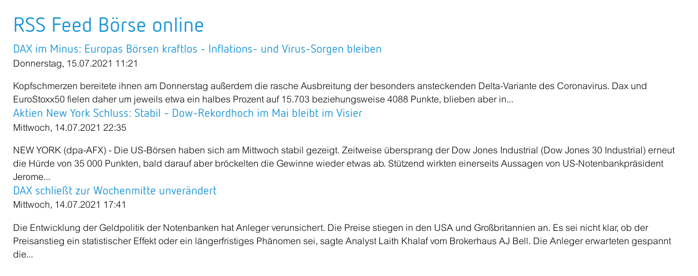
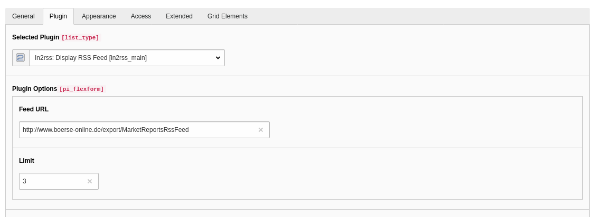

# in2rss

Show a rss feed on your website

## Changelog

| Version    | Date       | State      | Description                                                                                                                                                                                |
| ---------- | ---------- | ---------- | ------------------------------------------------------------------------------------------------------------------------------------------------------------------------------------------ |
| 1.0.0      | 2021-07-15 | Bugfix     | Released the old extension for TYPO3 6.2 - 8.7 to the public |
